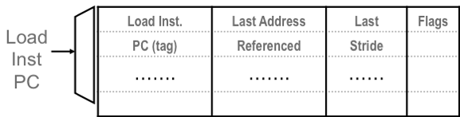
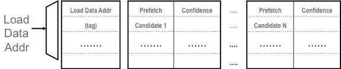
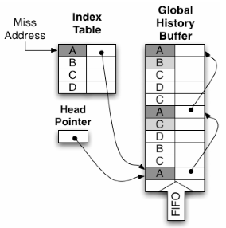
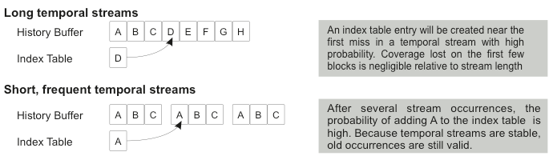
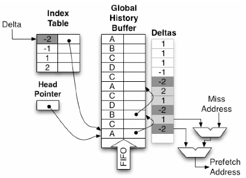
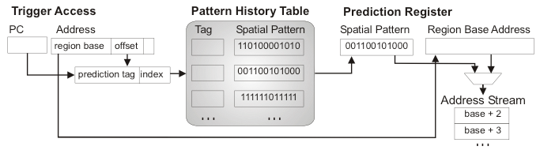
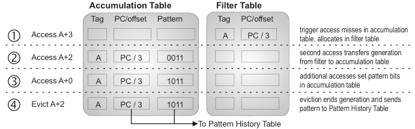

# 3数据预取 Data Prefetching
 
数据缺失模式源于算法和高级编程结构对内存中组织和遍历数据的内在结构。在传统的冯·诺依曼计算机系统中，指令缺失模式往往比较简单，遵循顺序模式或重复控制转移在一个良好的结构化控制流图中，而数据访问模式可以更加多样化，特别是在允许多次遍历的指针链接的数据结构中。此外，代码往往是静态的，因此很容易预取（除了最近的虚拟化和即时编译机制外，这些机制往往会阻碍指令预取），但数据结构会在执行过程中发生变化，导致遍历模式改变。这种访问模式中的复杂性增加导致了比指令预取器更广泛的丰富的设计空间。

我们将数据预取器的设计空间分为四大类。第一类是依赖于简单步长模式的预取器，它们直接将下一行指令预取概念推广到数据上。第二类是依赖于重复遍历序列的预取器，通常利用地址之间的指针关系。第三类是依赖于规则（尽管可能是非步进）的数据结构布局的预取器。最后一类是探索常规乱序指令窗口之外的机制，因此不依赖于内存访问地址流中的规律性和重复性。

## 3.1  数据的步长和流预取器 STRIDE AND STREAM PREFETCHERS FOR DATA

我们研究的第一类数据预取器是步长和流预取器，这是为指令开发的下一行和流预取机制的直接演变。这些预取器捕获在虚拟地址空间中连续排列或由常量步长分隔的数据的访问模式。此类预取器对于密集矩阵和数组访问模式通常是高度有效的，但对于基于指针的数据结构一般提供很少的好处。步长数据预取器广泛部署在工业处理器设计中，从老式的IBM System/370系列到现代高性能处理器。直到最近，人们认为这一类硬件数据预取器是唯一被商业部署的类别。

早期描述的顺序数据预取器实现仅限于只预取连续地址处的块，早在1978年就已出现[5]。到了20世纪90年代初，这样的预取器扩展以检测并预取间隔不是恒定步长的访问序列[29]。当遍历多维数组时，这类步长访问模式经常出现，当聚合数据类型（例如C中的结构体）存储在数组中时。即使在基于指针的数据结构中，由于动态内存分配器连续地将常量大小的对象布局在内存中，也会偶然出现步进访问的情况，这是池分配器的常见情况。Dahlgren和Stenstrom详细研究了顺序预取机制和步进预取机制的相对优点和有效性[30]。

在步伐预取技术中，一个关键挑战在于区分多重交错的等差序列，比如矩阵-向量乘法。图 3.1 展示了 Baer 和 Chen 所提方法的流程图，该方法基于每次加载指令来跟踪步伐。他们的参考预测表是一个带标记的关联数组结构，使用加载指令的程序计数器 (PC) 作为查找键。每个条目保存着最后一次加载所引用的地址，以及前两次引用之间地址（即步长）的差异。每当连续观察到相同的步长时，就用最后的引用地址和步长来计算一个或多个额外的预取地址。后续访问如果继续匹配记录的步长就会触发额外的预取操作。这种连续的等差访问序列被称为流，类似于指令流水线预取器。Ishii 等人描述了更复杂的硬件结构，可以紧凑地表示多个步长 [31]，而 Sair 等人通过预测步长长度扩展了对流的预取支持，以处理更不规则的模式[32]。

<figure>
  
  <figcaption>图3.1：Baer和Chen的参考预测表。来自[29]。</figcaption>
</figure>

另一个关键实现问题是，在检测到具有步幅的流时，决定要预取多少块。这个参数通常被称为预取程度或预取深度，理想情况下应该足够大，使得预读取的数据在被处理器引用之前到达，但不能太大，以至于在访问之前就替换块或者对短流造成不适当的污染。Hur 和 Lin 提出了一些简单的状态机，它们跟踪最近流的长度直方图，并且能够根据需要为每条不同的流确定合适的预取深度，使流预读取器即使对于只有几个地址的短流也能有效地工作[33]。

传统上，行级预取程序会立即将其检索的数据直接放入缓存层次结构中。然而，如果行级预取器过于激进，它们可能会污染缓存并使有用数据失去位置。Jouppi [34] 描述了另一种组织方式，在其中流式预取程序将数据存储在称为流缓冲区的单独缓冲区中，并且这些缓冲区在 L1 缓存之后或同时访问。通过将数据放入流缓冲区，低精度流（其中许多数据被检索但不用于) 不会挤出缓存中有用的数据，从而降低了不准确预取的风险。然而，错误的预取仍然消耗能量和带宽。Palacharla 和 Kessler 评估了一个内存系统组织，在这种组织下，流缓冲器完全取代了二级数据缓存[35]。

每个流缓存持有来自单一流的数据块缓存区。处理器从流缓存中查询访问，通常与L1缓存的访问同时进行。流缓存的命中通常会导致请求的块传输到L1缓存，并从流中获取额外的块。在某些变体中，流缓存是严格的FIFO，并且只能访问每个流缓存的头部。在其他变体中，流缓存是关联搜索的。当步长检测机制观察到一个新的流时，整个流缓存会被清空并重新分配（丢弃任何未引用的块），通常根据轮询或最近最少使用方案。

张和McKee[36]和Iacobovici及其合著者[37]分析了针对流预读取器的额外实现考虑和优化。

## 3.2 地址相关预取 ADDRESS-CORRELATING PREFETCHERS

虽然步长预读取器通常对于基于指针的数据结构，例如链表，无效，但第二类我们考虑的预读取器是专门设计用于针对此类数据结构的指针追逐访问模式。这种类型的预读取器不依赖于内存中数据布局的规律性，而是利用算法倾向于反复遍历数据结构的事实，导致重复缓存未命中的序列。

早在1976年就有人提出了对内存位置对之间访问的相关性的建议[38]。Charney和Reeves首先描述了寻求利用这种成对相关关系的硬件预读取器，创造了“相关性预读取器”的术语[39, 40]。后来的工作将地址相关性的概念从成对扩展到访问组或序列[41, 42]。Wenisch等人引入了“时间相关性”一词来指代两个在时间上接近访问的地址将来很可能会一起再次访问的现象。时间相关性类似于“时间局部性”，即最近访问的地址在不久的将来很可能再次访问。而缓存则利用时间局部性，地址相关性预读取器则利用时间相关性。

### 3.2.1 跳转指针 JUMP POINTERS

相关前缀是一种硬件或软件机制，专门针对跟踪指针访问模式。这些早期的方法依赖于跳转指针的概念[43, 44, 45, 46]，即在数据结构遍历中实现大范围向前跳跃的指针。例如，在链表中的一个节点可以附加一个指向该列表中十个节点的指针；前缀预测器可以跟随跳转指针以提前查看正在执行的主要遍历由CPU进行及时预取。依赖跳转指针的预读器通常需要软件或编译器的支持来注释指针。基于内容的预读器[47, 48]避免了注释，并尝试解引用并预读任何似乎形成有效虚拟地址的负载值。虽然跳转指针机制对于特定的数据结构遍历（例如链表遍历）非常有效，但它们的主要缺点是必须仔细平衡跳转指针在遍历中前进的距离，以提供足够的预测而不会跳过太多元素。跳转距离很难调整，指针本身可能很昂贵。

### 3.2.2 成对相关性 PAIR-WISE CORRELATION

简而言之，基于相关性的硬件预取器就是一个查找表，它从一个地址映射到另一个地址，这个地址很可能在访问序列中紧随其后。虽然这种关联可以捕获顺序和步长关系，但它更为通用，例如可以捕获指针地址与其指向地址之间的关系。正是捕捉指针遍历的能力赋予了地址相关预取器比步长预取器更高的性能提升机会，因为现代处理器上指针追逐的访问模式非常缓慢。然而，地址相关的预取器依赖于重复；它们无法预取从未引用过的地址（与步长预取器不同）。此外，地址相关预取器需要大量的状态，因为它们需要为每个地址存储继任者。因此，它们的存储需求与应用程序的工作集成正比增长。地址相关预取器设计中的许多创新都围绕着管理这些庞大的状态展开。

### 3.2.3 马尔可夫预取器 MARKOV PREFETCHER

Markov 预取器 [49, 50] 是利用地址对之间的相关性设计的最简单的预取器。它直接实现了一个查找表，用于将触发地址映射到片外访问序列中的下一个地址。然而，由于地址（尤其是以高速缓存块为粒度考虑时）通常会在多个遍历中参与，只存储每个触发地址的一个后继地址会导致效率低下。相反，Markov 预取器会存储几个先前观察到的后继地址，当发生触发地址缺失时，所有这些地址都会被预读取。通过预读取多个可能的后继地址，Markov 预取器牺牲了准确性（正确预读取的数量与总预读取数之比）来提高覆盖率（成功预读取的需求缺失占总数的比例）——预期仅有一个由预读取器请求的地址是正确的。获取的后继地址数常被称为预取宽度。

<figure>
  
  <figcaption>图3.2：[49]中描述的马尔可夫预取器。 </igcaption>
</figure>

**马尔可夫预取器**的结构是一个位于芯片上的组相联表，该表以触发地址为索引（见图3.2）。表中的每一项包含一组需要预取的后续地址，以及可选的置信度或替换策略信息；通常支持四个后续地址。最初的研究[49]提出了使用1MB的查找表。然而，所需的查找表大小会随着应用程序数据足迹的增长而增加，后续研究表明，现代工作负载需要更大的表才能实现有效的预取[51]。

马尔可夫预取器的设计灵感来源于对芯片外访问序列建立马尔可夫模型的概念。在该模型中，每个状态对应一个触发地址，可能的后续状态则对应随后发生的缺失地址。在一阶马尔可夫模型中，转移概率表示每个后续缺失的可能性。查找表的目标是存储那些最常遇到的触发地址所对应的、具有最高转移概率的后续地址。然而，现有的硬件设计方案并没有显式地计算触发或转移概率；触发地址及其对应的后续地址都是通过启发式方法管理的，例如使用最近最少使用（LRU）替换策略。

有两个因素限制了马尔可夫预取器的效果：(1) **前瞻性和内存级并行性受限**，因为预取器仅尝试预测下一个缺失；(2) **覆盖率受限**，受限于芯片上的相关表容量。接下来我们将讨论几种针对这些限制提出的改进方案。

### 3.2.4 通过预取深度改进前瞻 IMPROVING LOOKAHEAD VIA PREFETCH DEPTH

马尔可夫预取器的第一个主要局限在于其**前瞻能力有限**——也就是说，触发地址与后续地址发生停顿之间的时间太短，无法掩盖所预取数据的访问延迟。

一个改进前瞻性的直接方法是**预取更远的地址**，即在预测的全局地址序列中提前获取更多地址[41]，这类似于增加流式预取器的深度。在类似马尔可夫预取器的结构中，可以通过使用初始预测的一组地址递归地进行表查找，从而发出更深层次的预取请求。然而，这种方法会带来**较高的查找延迟**，并显著增加对马尔可夫表的带宽需求。此外，随着预取深度的增加，可能的预取候选地址数量呈几何级增长，因此需要一种合适的策略来**限制这种增长**，以保持预取的准确性。

或者，与其进行连续查找，可以折叠预取表以存储每个预取触发器旁边的短序列（也称为流）后继项。 [52、53] 仍然需要适当策略来选择要记录的后继流，例如最近或最高概率的后继。这种方法解决了查找延迟/带宽问题，但可能会使表更新变得复杂，因为可能需要在多个条目中记录地址（例如，对于直接前驱，其前驱等）。然而，一个更深层次的问题是，这样的表组织必须将最大预取深度固定为每个表条目中提供的存储空间。如果分配的存储空间太少，流就会被截断，牺牲了潜在覆盖率和前瞻能力。另一方面，如果深度太高，则会浪费存储空间，甚至更糟的是，准确性可能会受到影响，因为在流尾部记录不相关的地址。已有几项研究表明，重复流的长度差异很大，从少至两到数千个缺失值。我们稍后讨论用于解决此问题的不同存储方案。

通常，流开始时的前几次缺失没有及时——触发缺失与随后块的访问时间过于接近，无法及时预取。记录并预取这些地址会浪费存储空间，并延迟流中更深处有用块的预取。因此，省去这前几个地址是有意义的，并从第一个可以提供延迟优势的缺失开始流。Chou等人观察到，在非指令流水线核心中，指令窗口经常导致多个芯片外缺失并发发出[56]。然后在处理此组缺失期间暂停执行。一旦这些缺失返回，指令窗口就可以继续，依赖地址可以计算出来，从而使下一批缺失能够并行发出。他们引用每个分组（epoch）中发出的平均缺失数来表示应用程序的内存级并行性。Chou提出了基于时间片的关联预取机制（EBCP），利用这一观察结果[57]。在EBCP中，每个时间片（epoch）内的第一个缺失用作触发地址，并用于查找下一个（或后续）时间片中的缺失，从而跳过可能已经在触发缺失时处于活动状态的缺失地址。

### 3.2.5 通过死块预测改进前瞻。 IMPROVING LOOKAHEAD VIA DEAD BLOCK PREDICTION

解决马尔可夫预取器前瞻能力限制的第二种方法是为每次预取操作选择一个更早的触发事件。**死亡块预测**（Dead Block Prediction）[51, 54, 60, 61, 62] 的核心观察是：缓存块在缓存中大部分时间是“死亡”的 [63, 64, 65] —— 也就是说，它们仍然保留在缓存中，但在被无效或驱逐之前不会再被访问。死亡的缓存块占用了存储空间，但不会带来任何缓存命中。因此，它们提供了一个机会：预取器可以用一个预取块来替换这些死亡块，而不会造成缓存污染的风险。

**死亡块关联预取器**（DBCP, Dead Block Correlating Prefetcher）[51] 的目标是预测某个缓存块的最后一次访问（即它的“死亡事件”），然后使用这次访问作为触发信号，预取将要替换该死亡块的新块。从某种意义上说，DBCP 最大化了前瞻能力，因为它在缓存中最早可用的空间出现时就发出预取请求。

DBCP 依赖于两个预测：

1. **必须预测缓存块何时会变成死亡状态**。  
   死亡事件可以通过**代码相关性**（code correlation）[51, 54, 62] 或**时间记录**（time keeping）[61] 来预测。
   
   - **代码相关的死亡块预测**试图识别在块被驱逐前最后一次访问它的指令，即导致该块死亡的那次访问。其基础在于：每当一个缓存块进入缓存时，它通常会被相同的加载和存储指令序列所访问——从最初分配该块的缺失开始，经过一系列访问，最终到该块死亡的那次访问。代码相关性的关键优势在于：为一个缓存块学习到的访问序列可以用于预测其他地址的死亡事件。我们将在第 3.3.3 节中详细讨论代码相关性。
   
   - **时间记录机制**则尝试预测一个缓存块死亡前的剩余时间，而不是具体指示死亡的那次访问 [61]。这种方法的依据是：同一个缓存块在其多次进入缓存的过程中，其生命周期（以时钟周期衡量）往往相似。在这种设计中，马尔可夫预取表会增加一个字段，记录该块上一次进入缓存时的生命周期长度。然后在安全余量（例如，两倍于上次生命周期）之后，预测该块已死亡。

2. **一旦预测到死亡事件，还需要预测一个合适的预取候选块来替换它**。  
   早期的死亡块预取器使用类似马尔可夫的预测表来完成这一任务 [51, 61]。后来的方案 [54] 则采用更复杂的**时间流预测器**（temporal stream predictors），我们将在第 3.2.9 节中详细介绍这类方法。

### 3.2.6  应对片上存储限制 ADDRESSING ON-CHIP STORAGE LIMITATIONS

**限制马尔可夫预取器有效性的第二个关键因素是其相关性表（correlation table）的片上存储容量有限。**

从根本上说，用于地址关联的元数据大小会随着应用程序的工作集（working set）而增长；理想情况下，相关性表应涵盖工作集中所有地址之间的访问关联。因此，相关性表所需的存储空间与数据集本身成正比——只是由于它存储的是地址而非实际数据，所以其存储需求比工作集小了一个比例因子，这个比例因子等于缓存块大小与地址大小的比值。

**提高马尔可夫预取器有效性的其中一个方法是提高片上相关性表的存储效率。**  
“标签关联预取器”（tag correlating prefetcher）[66] 就是一种尝试：它在相关性表项中仅存储地址的标签（tag）部分，而不是完整的缓存块地址。这种改进减少了每个表项所需的存储空间，但相关性表的总容量仍然只能以一个较小的常数因子提升，这对于具有大规模工作集的应用程序（例如服务器类应用）来说仍不足以实现高覆盖率。

另一种方法是将相关表移到主存储器中，从而消除片上相关表的容量限制。[42][52][54][67][72] 从芯片外获取的相关表可以实现高覆盖率，即使对于具有大工作集的工作负载也是如此。 [52]但是，将相关表移出芯片会增加预取元数据的访问延迟，从几个时钟周期变为片外内存引用的延迟——因此，访问预取元数据可能需要花费与预取所需缓存块一样长的时间。

为了有效，片外相关表必须提供足够的预测以隐藏长元数据访问延迟。一种方法是在第 3.2.4 节中讨论的，设计一个前缀来为将在未来并行组（epoch）发生的内存引用记录地址，如EBCP [57]所示。另一种方法是增加前缀深度；即使第一个要预读取的块没有及时到达，后续地址也会成功预读取。增加前缀深度的一般化形式是时序流[42]，在第 3.2.9 节中有所讨论，它通过针对任意长度的流（即有效地无限制的前缀深度）[67] 来平均片外元数据引用。

### 3.2.7 全局历史缓存 GLOBAL HISTORY BUFFER

马尔可夫预取器的类似缓存的组织方式限制了它只能记录固定长度的流——一个表项只能存储有限的预取深度。窄表项牺牲了潜在覆盖率和预测能力，而宽表项对于短流来说在存储方面效率低下。可以通过指针链接条目，但是这会增加查找延迟，并且如果相关表位于芯片之外，则特别不受欢迎。Wenisch 和合著者研究了商业服务器应用程序中的重复时间相关流，并证明流的长度从两个到数千个缓存块不等。最常出现的流长度只有两次击中，这意味着宽的马尔可夫表项在存储方面效率很低。然而，当按流中错过的次数加权（即通过预读取流可以获得的潜在覆盖率）时，中位数流长约为十次缓存块。

Nesbit 和 Smith 在他们的全球历史缓冲区中引入了一个关键进步[68]，将相关表分为两个结构：一个历史缓冲器，它在循环缓冲器中以它们发生的时间顺序记录了丢失序列，并且一个索引表，它为地址（或其他预取触发器）到历史缓冲器中的位置提供映射。历史缓冲器允许单个预取触发器指向任意长度的流。图 3.3（来自 [68]）显示了全局历史缓冲区的组织。

索引表保留了与原始 Markov 预取器相似的集关联存储组织。然而，它不再存储缓存块地址，而是存储到历史缓冲区中的指针。当发生缺失时，GHB 引用索引表以查看是否有关于缺失地址的相关信息。如果找到条目，则会跟随该指针然后检查历史缓冲区中的条目，看它是否仍然包含缺失地址（该条目可能已经被覆盖）。如果是这样，历史缓冲器中接下来的一些条目包含了预测流。历史缓冲区条目还可以附加到其他历史缓冲区位置的链接指针，以便根据多个顺序进行历史遍历（例如，每个链接指针都指示同一缺失地址的先前出现，从而允许增加预取宽度以及深度）。

<figure>
  
  <figcaption>图3.3：地址相关全局历史缓冲区（GHB G/AC）。来自[68]。 </figcaption>
</figure>

通过改变索引表中存储的关键信息以及历史缓冲区条目之间的链接指针，GHB 设计可以利用各种将触发事件与预测的预取流相关联的特性。Nesbit 和 Smith 提出了一种 GHB 变体的分类方法，形式为 GHB X/Y，其中 X 表示流的定位方式（即链接指针如何连接应被连续预取的历史缓冲条目），Y 表示关联方法（即查找过程如何定位候选流）。定位方式可以是全局（G）或基于程序计数器（PC）。在全局定位中，连续记录的历史缓冲条目形成一个流。每个历史表条目的指针要么指向同一缺失地址的早期出现位置（有助于提高预取宽度），要么未被使用。在基于 PC 的定位中，索引表和链接指针根据触发访问的 PC 来连接历史缓冲条目；由同一 PC 发出的连续缺失通过链接指针连接，从而形成一个流。关联方法可以是地址关联（AC）或差值关联（DC）。在本节中，我们讨论的是全局地址关联变体 GHB G/AC，其中索引表将缺失地址映射到历史缓冲区的位置。在第 3.3.2 节中，我们讨论 GHB PC/DC（程序计数器局部化的差值关联），它根据连续缺失之间的步长来记录历史，并以每个 PC 为基础进行缺失历史的本地化。文献中还讨论了其他几种关于定位和关联的替代方案 [68, 69]。

在GHB组织中，一个挑战是在确定何时停止跟踪流时，即当预取器不再需要从历史缓冲区中提取额外地址时。许多基于GHB组织的建议（例如[42]）都没有尝试预测流的结束。相反，它们为每个成功的索引表查找分配一个流缓冲区，并继续跟踪流，只要它继续提供预取命中。通过最近最少使用替换等方法，对不再有用的流分配的流缓存进行回收。We-nisch讨论了随着流被跟踪而自适应地调整流预读速率的问题[42]。

### 3.2.8  流链式链接 STREAM CHAINING

GHB 的一个缺点是，它通常会发现较短的流，尤其是当按每台计算机进行流本地化时，很难实现足够的预测。通过辅助查找机制将单独存储的流连接起来，可以延长流的长度，该机制可预测从一个流到下一个流的关系[58, 59]。流链式链接将由不同处理器组成的流连接在一起，以创建更长的预取序列[59]。流链式链接依赖于这样的见解：连续的 PC 本地化流之间存在时间相关性；也就是说，相同的两条流倾向于连续出现。一般而言，我们可以想象出一条指示每个后续流最有可能跟随哪个前继流的流之间的有向图。流链式链接为每个索引表条目添加了一个指向下一个流的指针，该指针表示在该流之后使用了哪个索引表条目，以及一个置信计数器。通过将单个 PC 本地化流连接在一起，流链式链接可以从单个触发访问中产生更正确的预取。

### 3.2.9 时序记忆流 TEMPORAL MEMORY STREAMING

最初提出的G HB索引和历史表很小，并位于芯片上，因此限制了G HB / AC变体对具有大工作集的工作负载的有效性。时间内存流[42]采用G HB存储组织，但将索引表和历史缓冲区都放在主存中，从而使它能够记录并重放任意长度的流，甚至对于具有大型工作集的工作负载也是如此。

芯片外的表格有两个挑战。我们在第 3.2.6 节讨论了元数据访问延迟和预取预测问题。然而，更新芯片外的表格也带来了挑战。由于必须在每次未命中时更新表，因此朴素的实现会将内存带宽增加三倍（一次用于缺失处理，另外两次分别用于索引表和历史缓冲区的更新）。

**历史表更新带宽**可以通过在芯片上维护一个小型缓冲区，并将连续的历史表追加操作合并为一次写入来轻松解决。但**索引表更新**不具有空间局部性，因此无法利用同样的优化方法。然而，Wenisch 及其合作者指出，可以通过对索引表更新进行采样，仅执行一部分历史表写入操作来控制索引表的更新带宽 [67, 70]。  他们的研究表明，覆盖大部分预取效果的流要么很长，要么频繁重复。对于**长流**来说，在流开始后的几次访问内，就有很大可能记录对应的索引表项，相对于整个长流而言，损失的覆盖率可以忽略不计。对于**频繁出现的流**来说，即使第一次访问时没有记录对应的索引表项，随着流的重复出现，记录到所需表项的概率也会迅速接近一。图 3.4（来自 [67]）说明了为什么采样是有效的。

<figure>
  
  <figcaption>图3.4：采样索引表更新对长和短、频繁的流有效。来自[67]。 </figcaption>
</figure>

最近，IBM 宣布 IBM Blue Gene/Q 包含一种新的预取方案，称为列表预取[71]，该方案与时间记忆流有许多相似之处，并且据我们所知，它是公开披露的此类预读取器的唯一商业实现。 列表预取引擎可以从主存储器中定位到已记录的失效率流中进行预读取。 地址列表可以通过软件 API 生成，也可以由硬件自动记录。 然而，列表预读取器不提供芯片外索引表； 软件必须协助预读取程序来记录、定位和启动流水线。 硬件随后会管理预读取的时间以及已记录流水线和 L1 失效率之间的微小差异。

### 3.2.10 不规则流缓冲区 IRREGULAR STREAM BUFFER

尽管采样可以降低在片外维护流元数据的开销，但查找延迟仍然较高，限制了短流的预取前瞻能力。此外，片外存储使得类似GHB（Global History Buffer）中基于PC的地址相关流的定位方式无法实现；在片外历史缓冲区中通过链表指针进行条目跳转速度太慢（也就是说，它并不比解引用一串依赖指针更快，而这正是时间流技术旨在加速的访问模式）。为了解决这些限制，Jain 和 Lin 提出了不规则流缓冲器（Irregular Stream Buffer, ISB）[72]。ISB 引入了一个新的概念性地址空间——结构地址空间（structural address space），该空间仅对预取器可见。当缓存块在最后一级缓存（LLC）中被访问时，它们会被分配连续的结构地址（可能会替换某个缓存块之前分配的结构地址）。通过这种重映射，物理地址空间中的时间相关性转化为结构地址空间中的空间相关性。因此，一个物理地址的时间流可以通过一个简单的“下一N行”流预取器来预取，该预取器向结构地址发出请求。两个片上表维护着物理地址与结构地址之间的双向映射。这些映射会随着 TLB 的填充和替换操作一起从片上表迁移到片外后备存储中，从而确保片上结构包含处理器当前能够访问的地址集的元数据。

### 3.3 空间相关预取 SPATIALLY CORRELATED PREFETCHING

空间相关前缀机制利用数据布局中的规律性和重复性。虽然时间相关依赖于一系列错失来重复，而不考虑具体的错过地址，但空间相关依赖于在时间上接近的一系列内存访问之间的相对偏移量模式。带步长的访问模式是空间相关性的特例；本节讨论的前缀器将带步长前缀扩展到更复杂的布局模式。

由于数据结构布局的规则性，空间相关性得以产生。程序经常使用在内存中具有固定布局的数据结构（例如面向对象编程语言中的对象、具有固定大小字段的关系数据库记录、堆栈帧）。许多高级编程语言通过与缓存行和页面边界对齐来排列数据结构，进一步增强了布局的规则性。

空间相关性的一个优点是，内存中的许多对象往往具有相同的布局模式。因此，一旦学习了空间相关性模式，就可以用它来预取多个对象，这使得利用空间相关性的预取器非常存储效率高（即紧凑的模式可以频繁地重复使用以预取多个地址）。此外，与依赖于特定地址重复缺失的地址相关性不同，空间模式可以应用于以前从未引用过的地址，从而消除冷高速缓存缺失。

与地址相关前缀器一样，空间相关前缀器也必须依赖触发事件来启动预取，这通常是一个内存访问或缓存未命中的情况。触发事件必须（1）提供一个密钥来查找描述相关布局模式的相关位置以进行预读的相对位置，并且（2）提供从其中计算这些相对地址的基地址。基地址通常是来自触发访问的有效地址。然而，为了能够为以前未看到的地址预读，布局模式的查找键必须独立于基地址（如果查找键只是基地址，例如在 GHB G/AC [68] 中，则我们将前缀程序分类为地址相关）。

### 3.3.1 Delta相关性前看 DELTA-CORRELATED LOOKUP

Delta相关性直接建立在空间相关性的概念之上，以布局模式本身的重复作为查找键——Delta相关性使用布局模式的前缀作为查找键。也就是说，两个或多个连续访问之间的步长（或总结序列的签名）被用作布局模式的查找键。Delta相关性（早期工作中称为距离预取）最初是在TLB预取的上下文中提出的[73]。

### 3.3.2 全局历史缓存 PC 本地化/差分相关 (GHB PC/DC) GLOBAL HISTORY BUFFER PC-LOCALIZED/DELTA-CORRELATING (GHB PC/DC)

从存储效率和覆盖率的角度来看，已知最有效的预取器之一是全局历史缓冲区 (GHB) 的程序计数器局部化差值相关变体（GHB PC/DC）[68,69]。GHB PC/DC 的硬件组织与第 3.2.7 节中讨论的 GHB G/AC（全局地址相关版本）相同，由索引表和历史表组成。GHB PC/DC 索引表中存储的关键是缺失内存访问指令的程序计数器值。具有相同 PC 的连续错误通过存储在历史缓冲区中的链接指针连接起来。当给定 PC 发生错误时，会访问历史表以识别来自同一 PC 的前两个错误，并通过链接指针从一个错误导航到下一个错误。通过减去错误地址来计算触发错误和前两个错误之间的差分（步长），产生一个双步序列。然后，预取器沿着 PC 链接指针继续在历史缓冲区中向后查找先前出现的相同双步序列。如果找到这样的模式，则通过从匹配处应用后续差分序列来计算预取地址，该序列起始于触发错误的基地址。整个搜索过程由一个状态机实现，它遍历索引表和历史表。

<figure>
  
  <figcaption>图3.5：历史缓冲区的全局相关性(GBG DC)。来自 [68] 。 </figcaption>
</figure>

尽管 GHB PC/DC 在具有非常有限存储（256 个条目索引表和历史缓冲区表）的情况下在 SPEC 基准测试中表现出显著的效果，但到目前为止，尚未研究其效果对于代码和数据足迹较大的工作负载（例如商业服务器或云计算应用程序）而言，它的扩展行为尚不清楚。

在 2011 年的第一次数据预取锦标赛中，对 GHB PC/DC 预取器的几个创新变体进行了评估，并在《指令级并行性杂志》的特刊中做了描述。[31][74][75][76][77][78]

### 3.3.3 代码相关查找 CODE-CORRELATED LOOKUP

PC 本地化步长/流预测器以及 PC 本地化的 GHB 的高效率表明，特定内存访问之间的空间关系通常与内存访问指令的 PC 值密切相关。例如，在矩阵乘法的内循环中，一个特定的加载操作会经常以恒定的步幅遍历内存。代码相关性通过观察复杂的遍历模式来推广了 PC 本地化的概念，这些模式通常由多个内存访问指令组成，并且也与发出指令的 PC 值高度相关。也就是说，一个特定的指令序列会在许多不同的基地址处反复地使用相同的内容搜索模式来访问内存。这种模式之所以会出现，是因为面向对象程序中的堆栈帧和对象具有固定的布局；执行为堆栈帧建立或调用对象上的特定方法的代码是可靠地指示即将出现的对堆栈帧/对象字段的内存访问模式的方法。

**代码相关预测**（Code-correlated prediction）最初是在用于预测缓存一致性状态机转换的机制中被探索的 [60, 79, 80]。我们此前在第3.2.5节中介绍了在**死块预测**（dead-block prediction）背景下使用的代码相关性，以提升地址相关预取的前瞻能力。

**代码相关空间预取器**（Code-correlated spatial prefetchers）将空间关系与触发事件的程序计数器（PC）值相关联，而不是与访问的数据地址或它们之间的差值相关联。此类预取机制的一般架构如图3.6所示（摘自[82]）。预取的触发事件是对某个特定（通常是固定大小）内存区域的首次访问或缺失。不同预取器设计中的区域大小各不相同，范围从最小的256字节 [81] 到最大的8KB [82] 不等。

<figure>
  
  <figcaption>图3.6：代码相关空间预取。摘自[82]。 </figcaption>
</figure>

当发生触发事件（例如L1缓存未命中）时，预取器会从该触发事件中构造一个查找键，并在**模式历史表**（pattern history table）中查找该键。此表将键与一个**空间预取模式**关联起来，表示要预取的相对偏移量。不同的预取器设计在触发事件、查找键的构造方式、空间模式的编码方式、模式历史表的组织结构以及训练预取器所用的机制方面可能有所不同。

**查找键**通常包括触发访问程序计数器（PC）的部分或全部位。已有几项研究 [81, 82, 83] 表明，若进一步包含数据地址的低位（尤其是区域内的偏移），可以提高预取的准确性。这些低位地址的作用是区分那些具有相似布局但相对于区域边界对齐方式不同的对象——对于每种可能的对齐方式，预测表中都会记录独立的条目。作为另一种方法，Ferdman 及其合作者提出仅使用程序计数器作为查找键存储单一模式，并利用低位地址将该模式旋转到正确的对齐位置 [84, 85]。

最简单的空间预取模式表示方式是一个**位向量**（bit vector），表示该区域中哪些部分（例如缓存行）需要被预取。该位向量结合区域的基地址（来自触发事件所请求的数据地址），即可生成需要预取的地址列表。

在下面的小节中，我们简要总结了特定代码相关前缀器设计的关键方面。

### 3.3.4 空间足迹预测 SPATIAL FOOTPRINT PREDICTION

最早且最简单的代码相关空间预取器是库马尔和威尔克森提出的 空间足迹预测 (SFP)[81]。在分离式扇区缓存（一种解耦合的缓存）背景下，他们研究了L1数据高速缓存访问中的重复布局[86]。通过打破标签与数据之间的一对一映射关系来实现小线程大小和低开销的标记组织。分离式扇区缓存是一种存储效率更高的扇区（也称为子块）缓存实现方式，允许大数组中靠近彼此的数据条目共享一个较小的标记数组中的标记。由单个标记覆盖的内存块被称为一个“扇区”，而数据数组则在该扇区内的每个小线程中存储各自的校验位。因此，在这种组织方式下，标记数组和数据数组的块大小不同，分别对应于扇区大小和线程大小。

SFP 的目标是通过在为新分块分配空间时预取额外的行，使松散耦合的分块缓存能够利用与常规缓存相同的空间局部性，同时获得小块大小的存储和带宽优势。作者研究了一个系统，其中 16KB L1 数据缓存是具有 128 字节分块但 8 字节行大小的松散耦合分块缓存，具有 2048 个数据数组条目但只有 512 个标签。

如图3.6所示，性能最佳的SFP变体将在每个扇区中存储其预测结果，并以PC和扇区内的行号作为索引和标记。模式历史表通过为每个扇区的标签条目添加额外的存储空间来训练模式历史表，用于导致该扇区被分配的错误的PC。当替换一个扇区时，此PC以及扇区中有效位向量将存储在模式历史表中。

### 3.3.5 空间模式预测 SPATIAL PATTERN PREDICTION

陈（Chen）及其合作者描述了一种空间模式预测器（Spatial Pattern Predictor, SPP）[83]，并展示了其在传统组相联缓存的环境下，可用于预取64字节缓存块，这些缓存块位于最大达1KB大小的更大区域内。这项研究的一个令人惊讶的结果是，空间模式预测可以被优化到仅需极小的存储空间；一个256项无标签预测器（总存储空间远低于1KB）即可为SPEC应用程序提供95%的覆盖率，同时错误预取率低于20%。该研究还进一步说明了如何将空间模式预测与电路技术[87]相结合，以减少缓存行中不太可能被访问部分的缓存漏电能耗。

### 3.3.6  隐式预取 STEALTH PREFETCHING

坎丁（Cantin）及其合作者提出了一种空间预取技术——“隐蔽预取”（stealth prefetching）[88]，专门针对基于广播监听总线的多处理器系统。隐蔽预取的目标是设计一种空间预取器，避免因积极预取共享内存块而带来的负面缓存一致性影响。该技术依赖于对共享和私有内存区域的粗粒度空间跟踪，并从私有区域预取数据至专用存储中，同时跳过了许多缓存一致性加载操作中的昂贵步骤；预取块的一致性得益于底层区域跟踪技术的安全保证。隐蔽预取的关键优势在于，预取操作不会在其他缓存中引发破坏性的监听操作。

### 3.3.7 空间记忆流 SPATIAL MEMORY STREAMING

鉴于SFP和SPP仅针对L1缺失流，从L2获取大部分数据，Somogyi及其合著者证明了代码相关空间预取对于芯片外的错误也是有效的。 [82]他们的研究也首次展示了在商业服务器应用程序中使用空间相关预取的有效性。 

SMS 设计使用了 8KB 的区域大小，并对模式历史表的存储效率训练进行了关键优化。由于 SMS 跟踪的空间模式比 SFP 或 SPP（仅 L1 缓存）具有更大的内存开销（所有芯片缓存），因此需要这种额外的结构。此外，虽然 SPP 和 SFP 只跟踪一组相邻缓存帧中的单个空间模式，但二级缓存的高关联性使得 SMS 能够同时跟踪多个空间区域在缓存中驻留变得很重要。为此，SMS 引入了一个空间区域生成的概念，从第一次访问该区域内的块开始，到从该区域弹出或无效任何块结束。SMS 的训练机制在整个生成中跟踪空间模式。模式会累加到活动生成表中，如图 3.7 所示。活动生成表的一个重要优化是在过滤表中使用以减少存储需求。当一个缺失引发一个新的空间区域生成时，相应的标记和触发 PC/偏移量首先放入过滤表中，过滤表由最近最少使用 (LRU) 替换管理。只有在对该区域第二次发生缺失的情况下，过滤表条目才会转移到累加表中，累加表会继续跟踪该空间区域生成，直到其中任何一个块被弹出，此时该空间模式会被记录到所有代码相关前缀设计共享的模式历史表中。过滤表的使用非常重要，因为大多数空间区域生成都是只有一个缺失的单例缺失；过滤表缓解了这些无用条目本来会给累加表带来的存储压力。

<figure>
  
  <figcaption>图3.7：用于空间记忆流中存储高效训练的结构。来自[82]。 </figcaption>
</figure>

尽管活动代表表有效地减少了训练SMS预取程序所需的存储需求，但为了获得最佳效果，所需的历史模式表大小仍然很大，约为 64 KB。因此，Burcea 和合著者提出的后续工作建议虚拟化模式历史表。代替一个大的专用表，虚拟化方法使用一个小的专用元数据缓存来在最后一级缓存中存储预取程序元数据以加速访问[89]。

### 3.3.8 空间暂态存储流  SPATIO-TEMPORAL MEMORY STREAMING

虽然对针对特定内存访问模式有效，但基于空间预取技术对于任意内存布局的基于指针的数据结构通常无效，并且在某些具有大量指针追踪访问模式的工作负载中表现出有限的有效性，例如联机事务处理 [90]。相反，地址相关预取技术在数据结构遍历不经常重复时效率低下。例如，步长和空间预取技术很容易识别内存复制和扫描访问模式，但是扫描可能太稀少，使得地址相关预取技术无法捕获[55]。因此，最新的预取建议寻求将地址相关性和空间预取合并为一个单一的设计。

时空记忆流（Spatio-temporal memory streaming）[91] 将 TMS（参见第 3.2.9 节）和 SMS（参见第 3.3.7 节）结合在一起。直接将这两种机制整合起来，可以使用 TMS 来提供未来触发访问（基地址和程序计数器）的预测流，然后由 SMS 预测每个区域中剩余的预取地址。虽然这种简单的方法在预测未来的访问方面很有效，但它会压垮内存系统，因为当失去单独机制的自然排序和限制时，它会产生大量的预取请求。

为了解决这一不足，时空内存流（spatio-temporal memory streaming）转而试图从空间机制和时间机制各自预测的地址中重建预取请求的完整顺序。SMS 被增强以维护缺失顺序信息，其方式是将空间模式编码为有序的偏移量流。尽管这种偏移量流形式不如 SFP、SPP 和传统 SMS 中使用的位向量紧凑，但它保留了正确交错空间流与时间流所需的顺序信息。与简单集成方式一样，TMS（Temporal Miss Stream，时间缺失流）机制为 SMS 查找提供了一系列触发器——基地址与程序计数器（PC）对。然而，在时空流中，空间流和时间流的条目还进一步增加了“差值”（delta），该差值表示在某一特定空间或时间流中两个连续地址之间，来自其他流的预取地址的数量。在预取过程中，这些差值用于通过将时间流中的预取地址填入一个重构缓冲区，并在其中预留出空白空间，等待后续的空间流地址填充，从而重建完整的缺失顺序。有关重构机制的详细内容请参见文献 [91]。

## 3.4 基于执行的预取 EXECUTION-BASED PREFETCHING

预取器的最后一类，我们简要讨论了它既不依赖于缺失序列中的重复，也不依赖于数据布局；相反，执行预取程序试图在指令执行和退休之前探索程序的指令序列，以发现地址计算和解引用指针。此类预取程序的主要目标是在比指令本身更快地运行时超越处理器核心，同时仍然使用实际的地址计算算法来识别预取候选者。因此，这些机制根本不依赖于重复。相反，它们依赖于要么总结地址计算并忽略其他方面的计算、直接猜测值，要么利用停滞周期和空闲处理器资源，在指令退休之前提前探索。 3.4.1 算法摘要

### 3.4.1 算法总结 ALGORITHM SUMMARIZATION

一些预取技术总结了遍历数据结构的指令序列，以便比主线程更快地执行预取数据结构元素。 Roth 和合著者提出了一个机制[44][45]，该机制通过识别指针加载（解引用指针的加载指令）并连接它们的依赖关系链来完全在硬件中汇总遍历。然后，硬件将这些依赖关系编码为紧凑的状态机，可以比指令执行更快地迭代依赖项加载序列。 Annavaram、Patel 和 Davidson 提出了一个通用机制，用于在硬件中提取程序依赖图——导致丢失加载的子集，并在专用预计算引擎中执行这些图[92]。

### 3.4.2  辅助线程和辅助核心方法 HELPER-THREAD AND HELPER-CORE APPROACHES

基于线程的数据预取技术 [93, 94, 95, 96, 97, 98, 99, 100, 101] 利用多线程或多核处理器上的空闲上下文来运行辅助线程（helper threads），从而通过推测执行将缓存缺失的等待时间与其他计算任务重叠，提升性能。不同的技术在以下几个方面存在差异：

- 是否为自动化的机制，或是否需要编译器/软件支持；
- 是否依赖同时多线程（SMT）硬件及特定的线程协调机制；
- 是否依赖额外的处理器核心；
- 是否需要额外机制将数据块插入远程缓存。

几乎所有情况下，这些技术都会重新利用空闲的执行上下文来运行预取代码。然而，当处理器运行具有高度线程级并行性的应用程序时，辅助线程所需的空闲资源（例如：空闲的核心或线程上下文、取指带宽和执行资源）可能无法获得。因此，在评估这些技术的收益时，必须权衡是否可以通过增加应用程序本身的线程数量来达到类似的效果。

### 3.4.3 抢先执行 RUN-AHEAD EXECUTION

抢先执行利用一个核心通常会在长延时事件（例如芯片外缓存未命中）上阻塞的执行资源，在阻塞的执行之前尝试着去发现额外的负载未命中的情况以及温暖的分支预测。抢先的想法是在核心阻塞的时候捕获一个执行状态快照，然后跳过阻塞指令继续获取并执行推测出来的指令流。依赖于不完整指令的数据相关指令不会被执行（例如通过重命名寄存器机制传播被污染的标记）。当长延时事件解决（例如原始缺失已返回）时，从快照中恢复执行状态并且让原来的执行继续，跨过抢先模式下探索过的指令重新执行。这种方案的主要好处是对长延时负载提供了prefetching效果。Dundas 和 Mudge首次在顺序执行的核心架构中提议抢先（102）。Mutlu等人针对非阻塞处理器探讨了高效的实现(103, 104, 105, 106)。最近，作者们研究了在长延时负载返回后不丢弃推测执行结果的非阻塞流水线微体系结构，而是只重新执行那些相关的指令（107, 108）。

### 3.4.4 上下文恢复 CONTEXT RESTORATION

随着云计算环境中多个应用程序在单个服务器上的虚拟化和多路复用变得越来越普遍，由于上下文切换而导致的指令高速缓存缺失成为了一个重要的特例。每次操作系统或hypervisor 在多重映射的应用程序之间或虚拟机之间切换时，一个应用程序的高速缓存状态就会被另一个应用程序所覆盖。当对延迟敏感的服务应用程序进行多路复用以与后台或批量任务一起运行时，这种缺失尤其有害——这是一种常见的做法，试图从服务应用程序等待用户请求而闲置的周期中获取价值。

上下文恢复预取器 [109, 110, 111] 旨在在发生上下文切换时（或在上下文切换后某些缓存块被替换时）捕获缓存中的内容，并在该上下文恢复执行时将这些缓存块重新加载到缓存中。与其它预取技术不同，这类机制无需预测需要预取的地址，其目标仅仅是恢复之前存在于缓存中的内容。

因此，其设计挑战主要集中在以下几个方面：

- 如何将缓存状态与特定的执行上下文关联起来；
- 如何管理预取操作的时效性，确保在上下文恢复时所需数据已加载到缓存中；
- 如何高效地记录和存储预取器所需的元数据。

这类机制特别适用于多任务或多线程环境中，有助于减少因上下文切换导致的缓存冷启动缺失（cold misses），从而提升系统整体性能。

### 3.4.5 计算扩散 COMPUTATION SPREADING

一种与基于执行的预取技术有某些相似之处、且正交于前述方法的提升缓存局部性的方式是**计算扩散（computation spreading）** [112, 113]。  
计算扩散利用线程迁移，将一个大规模计算任务的执行拆分到多个核心上执行，并在每个核心上集中处理相似的执行片段（execution fragments）。这种执行方式使得各核心私有的指令缓存、数据缓存（以及其他结构，如分支预测器）能够针对特定类型的执行片段进行“专业化”优化，从而提高缓存的局部性。

该方法已在以下场景中得到验证：

- 将应用程序代码和操作系统代码片段分离执行 [112]；
- 对在线事务处理（OLTP）线程的不同执行阶段进行划分 [113]。

通过这种方式，计算扩散能够在不改变程序语义的前提下，改善多核系统中的缓存行为，是一种从执行分布角度提升性能的独特思路。

## 3.5  预取的调节与控制 PREFETCH MODULATION AND CONTROL

许多研究者对预取的调节与控制技术进行了研究，并探讨了预取与其他内存系统组件之间的交互关系，例如缓存替换策略。虽然大多数研究是在**基于步长流（strided stream）的预取器**背景下开展的，但这些机制通常具有通用性，可以适用于任何生成预取候选地址的算法。

以下是相关研究成果的概述：

- **Srinath 及其合作者**提出了一种硬件机制，用于跟踪激进预取可能引起的缓存污染，并在预取准确率或时效性下降、或污染显著增加请求缺失率时，动态降低预取器的激进度 [114]。
  
- **Ebrahimi 及其合作者**研究了在多核系统中协调各个核心预取器激进度的机制，以缓解带宽竞争问题 [115]。

- **Lee 及其同事**分析了预取器与 DRAM 存储体（bank）竞争之间的相互影响，并提出了重新排序预取请求的方法，以提升 DRAM 存储体级并行性，从而提高预取吞吐量 [116]。

- **Hur 和 Lin** 提出了动态检测数据流结束位置的机制，以减少由于短流造成的缓存污染和带宽浪费 [33]。

- **Lin 等人**建议将预取块插入到组相联缓存中最近最少使用（LRU）位置，以控制缓存污染，并通过调节预取器的发起速率来优化性能 [117]。

- **Wu 及其同事**在此基础上进一步发展，提出了几种动态方法，用于决定预取块应在缓存替换栈中的哪个位置插入 [118]。

- 最后，**Verma、Koppelman 和 Peng** 提供了由软件控制预取激进度的机制，为系统开发者提供了更细粒度的调控能力 [119]。

这些研究共同构成了一个关于如何有效管理预取行为、避免负面影响并最大化性能收益的综合视角，是现代高性能计算系统设计中的重要组成部分。

## 3.6  软件方法 SOFTWARE APPROACHES

研究人员已经提出了许多其他方法来处理编译器或程序员插入的预取指令（例如，[41, 43, 120, 121, 122, 123）] 或数据前推操作[124,125]。最近，研究人员开发了架构[126, 127] 和编程语言[128, 129]，它们提供了直接表达和操纵数据流的结构。然而，这些研究主要集中在多媒体应用程序上，在这种情况下，应用程序输入自然地映射到数据序列。目前尚不清楚如何在其他情况下利用这些进展，例如商业服务器软件。对软件和编译器数据预读技术的全面探索超出了本综合讲座的范围。
