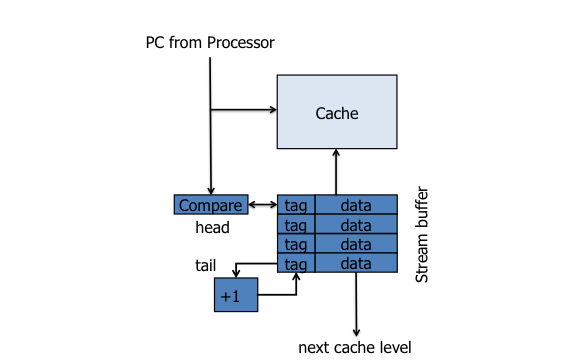
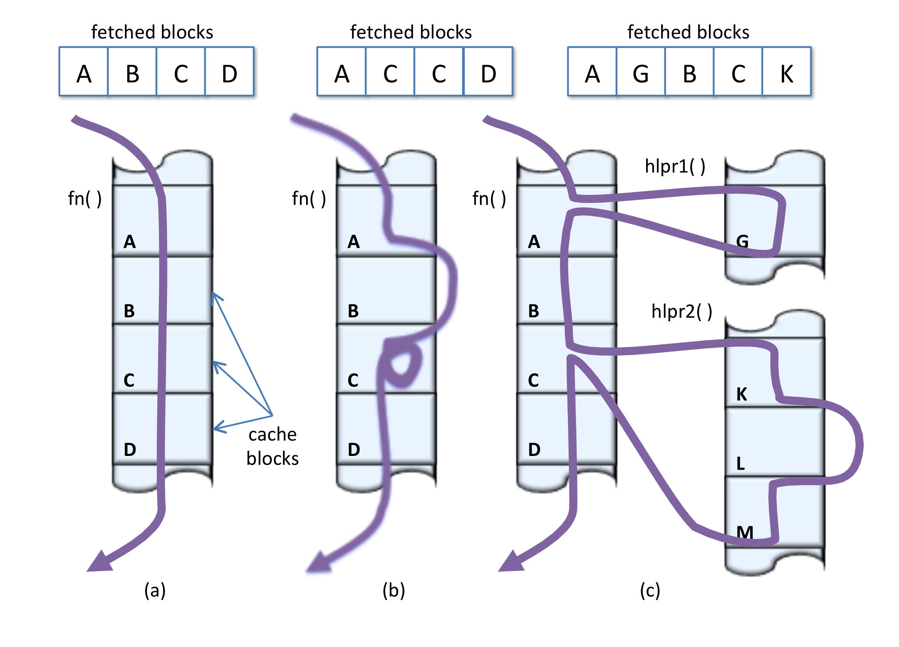
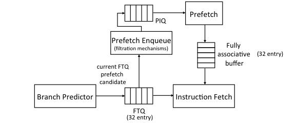
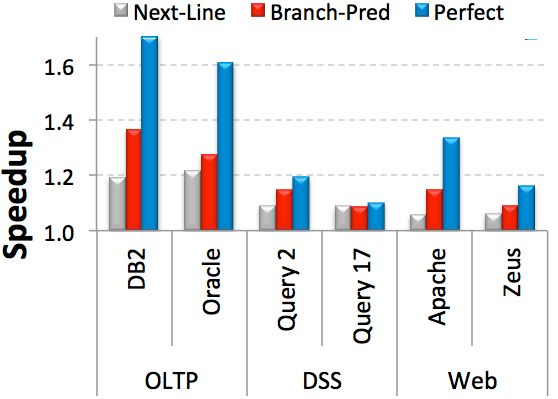
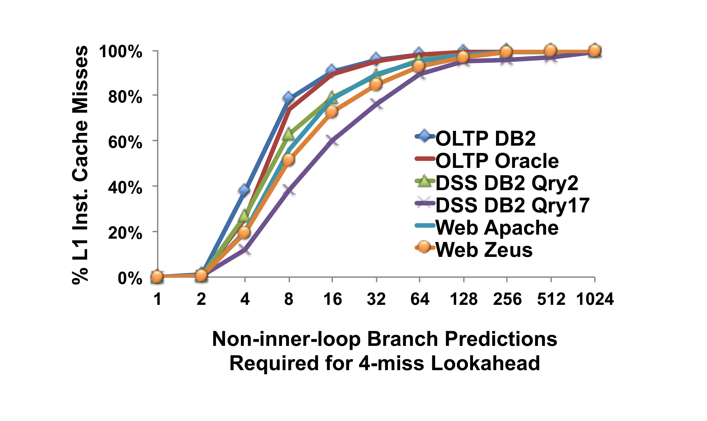
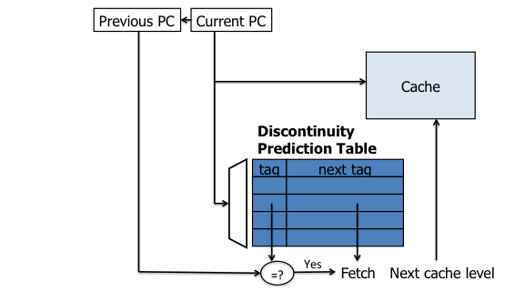
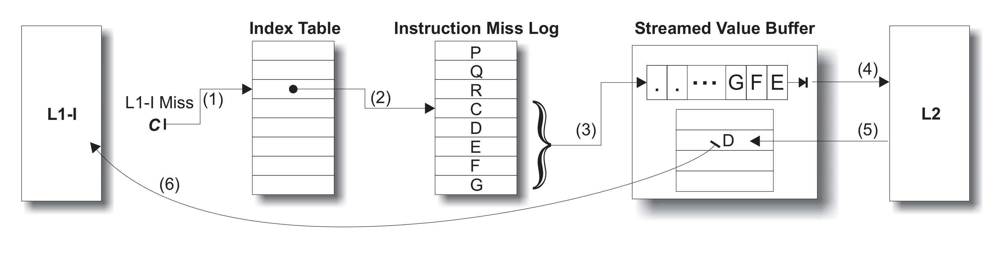
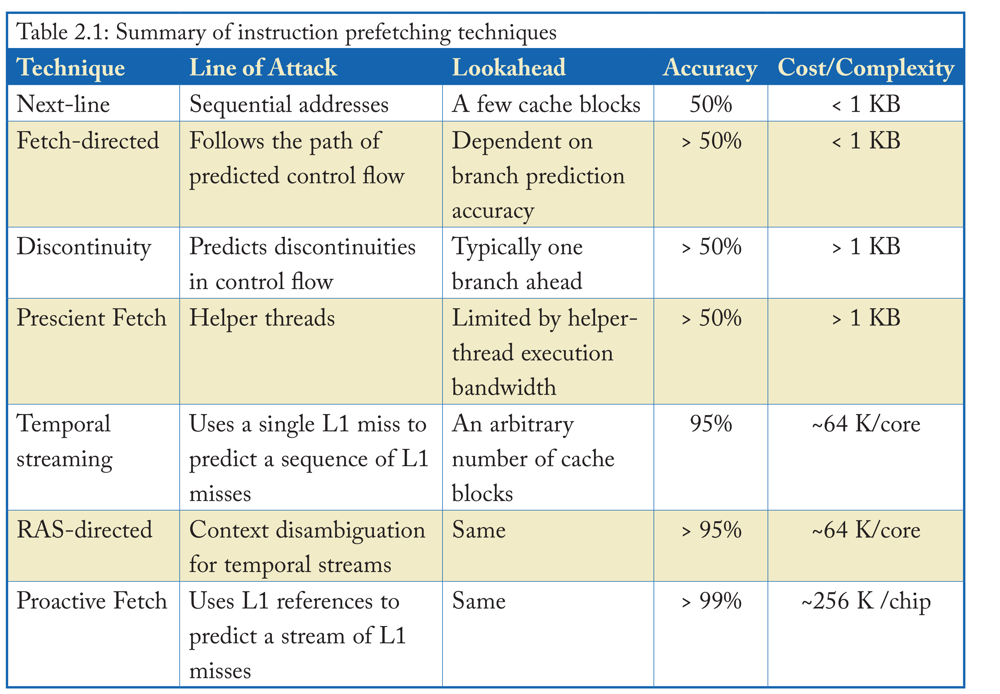

# 指令预取

指令获取停滞对于具有大指令工作集的工作负载来说是性能的致命伤；当指令供应速度减慢时，处理器流水线的执行资源（无论多么丰富）都会被浪费。桌面和科学计算工作负载通常表现出较小的指令工作集，而传统的服务器工作负载和新兴的云计算工作负载则往往展现出远超高层缓存所能容纳的主要指令工作集。随着软件快速开发、脚本范式以及软件栈深度不断增加的虚拟化环境的趋势，主要指令工作集也在快速增长。现代硬件指令调度技术，如乱序执行，通常在隐藏由于数据访问及其他长延迟指令造成的部分或全部停滞方面是有效的。然而，乱序执行通常无法隐藏指令获取的延迟。因此，在服务器中，指令停滞常常占据了总体内存停滞的很大一部分。

## 2.1  下一行预取 

下一行预取[5] 是指令预取最简单的形式，它在大多数现代处理器设计中很常见。由于代码按顺序排列在内存中的连续地址处，因此指令高速缓存中查找的一半以上是针对连续地址的。 生成连续地址并获取它们所需的逻辑最少，并且可以轻松地集成到处理器和高速缓存层次结构中。 

<figure>
  
  <figcaption>一个下一行预取器。</figcaption>
</figure>

图2.1描绘了现代处理器管道中下一行预取器的结构。指令预取缓冲区或流缓冲区是一个小关联缓冲区，它存储从较低级的缓存层次结构检索到的预取指令高速缓存块。每次处理器显式请求来自预取缓冲区的一个块时，该块就会被转移到高速缓存，并且会从内存中预先取出下一个连续块。

在 1960 年代后期，IBM System/360 Model 91 中出现了顺序指令预取技术的第一个实现。[6] 多项研究成果指出了下一行预取对服务器工作负载的重要性。[7][8] 许多人也将简单的下一行预取方案扩展到任意长度的连续基本块序列。[9][10]

## 2.2   取指定向预取

下一行预取器非常有效且高效，但只有 50% 的指令查找是顺序执行。控制流指令会破坏连续获取并导致获取中的不连续，并因此需要预测未来的控制流程和提前查看。

<figure>
  
  <figcaption>一个下一行预取器。</figcaption>
</figure>

图2.2比较了控制流产生的顺序获取和中断。图2.2 (a)显示了指令高速缓存块的顺序提取。顺序提取可以通过下一行预取有效地覆盖。图2.2 (b)描绘了两种不同类型的中断，一种是由if语句引起的假分支，因此需要绕过一个或多个高速缓存块进行提取，另一种是由循环引起的。图2.2 (c)描绘了由函数调用引起的中断。

基于分支预测器的预取技术 [11,12,13,14,15] 利用现有的分支预测器来探索未来的控制流。这些方法使用分支预测器递归地进行未来预测，以查找预取指令块的地址。由于分支预测器在第一阶上与流水线其余部分解耦，因此理论上可以在任意程度上提前执行以预测未来的控制流。

<figure>
  
  <figcaption>一个下一行预取器。</figcaption>
</figure>

图2.3：取指定向预取。来自[12]。取指定向预取（FDIP）[12] 是最好的分支预测器导向技术之一。图2.3显示了FDIP的结构。FDIP通过在L1指令获取单元中引入一个取指目标队列（FTQ）来解耦分支预测器与停顿， 在这两者之间引入。 预取器使用 FTQ 中的地址从 L2 缓存中获取指令块并将其放入一个小的全关联缓冲区中，并与其他 L1 指令获取重叠。缓冲区由并行于 L1 缓存的指令获取单元访问。为了避免缓冲区和 L1 之间的冗余，FDIP 使用空闲的 L1 指令缓存端口来探测缓存以查看 FTQ 中的地址是否已经存在， 并且只在缺失的情况下才在预取指令队列（PIQ）中为预取进行排队。图2.4说明了类似于FDIP的机制对商业服务器应用程序中的预取的有效性， 其中由于指令缓存缺失而产生了大量的停顿。

<figure>
  
  <figcaption>一个下一行预取器。</figcaption>
</figure>

<figure>
  
  <figcaption>一个下一行预取器。</figcaption>
</figure>

## 2.3   非连续预取

在函数调用、跳转分支和陷阱中断中，取指令序列的顺序被打破时进行预读取会面临更大的挑战。

有许多方法可以解决控制流程不连续的问题。错误路径预取[16]是一种简单的方法，它使用分支预测器来解决FDIP的基本问题，但预测相反的路径。虽然它的有效性有限，但它能预测出FDIP无法预测的依赖于数据的分支以及通过反向循环分支出口的指令。

分支历史引导预取[17]，执行历史引导预取[18]，多流预测器[10]，下一个轨迹预测器[19] 和调用图预取[20] 预测基于早期指令的关键不连续性，独立于分支预测器进行跟踪。在观察到服务器应用程序具有重复函数的深调用堆栈之后，调用图预取[20] 试图同时预测未来的调用堆栈，而不仅仅是下一个不连续。

最近的一个例子是断点预测器[21]，如图 2.6 所示。它维护了一个查找表，用于将包含跳转分支的目标块的程序计数器映射到跳转目标。据报道，某些商业处理器产品中存在类似的实现。由于下一条指令预读取器在预读取单元之前探索路径，因此每当遇到匹配项时，它都会根据每个块地址查询不连续性表，并且除了按顺序之外还预先读取不连续路径。尽管它的结构很简单并且只需要最少的硬件，但是断点预测器只能跨越一个断点；递归地查找以探索其他路径会导致预先读取的块的数量呈指数级增长。最多只允许跨越一个断点的限制限制了预读取器的瞻前顾后能力。此外，覆盖率有限，因为表格只会为高速缓存块记录单个断点，而在有些情况下，在指令块内会发生多个跳转分支。

<figure>
  
  <figcaption>一个下一行预取器。</figcaption>
</figure>

## 2.4 预见性获取 

人们提出了使用空闲或并行资源进行指令预取的方法。 预知式获取技术[22][23][24][25] 使用辅助线程来识别关键计算和控制转移，并提前执行，以帮助运行速度较慢且与辅助线程并发的主要线程。 尽管这些方法可用于循环之外和函数调用之外的指令预取，但仅预知式指令获取[22] 是专门为此目的设计的。 假设线程技术识别必要的关键执行信息并利用它在主要线程之前提前发出指令预取请求。 尽管假设线程技术可以跨多个预取不连续区进行迭代，但由于它们按单个指令粒度遍历未来指令流，因此其预测保持有限，因此通常必须遍历许多指令才能找到新的缓存块以预先加载。

### 2.5 时序指令流取

时序指令获取流（TIFS）[7]旨在解决辅助线程和基于预测/不连续机制的寻址限制。 通过记录并重放重复发生的L1指令缺失序列，而不是探索程序控制流程图，TIFS直接预测未来的指令缓存缺失。

<figure>
  
  <figcaption>一个下一行预取器。</figcaption>
</figure>

图2.7（来自[7]）展示了TIFS的设计。L1指令缓存缺失被记录在一个指令缺失日志中，该日志是一个循环缓冲区，要么在专用存储器中维护，要么在L2缓存中维护。一个单独的索引表保持从指令块地址到上次在日志中记录该地址的位置之间的映射。一个从C到地址的L1-I缺失会查询索引表(1)，该索引表指向一个指令缺失日志条目(2)。从C开始的一系列地址从日志中读取，并将缓存块地址发送到流值缓冲区(3)。流值缓冲区请求流中的块(4)，L2返回内容(5)。稍后，在后续对D的L1-I缺失时，缓冲区将内容返回给L1-I(6)。

### 2.6 返回地址栈定向指令预取 RETURN-ADDRESS STACK-DIRECTED INSTRUCTION PREFETCHING

由于无法预测循环返回分支和不可预测的条件分支，**取指方向指令预取器**（Fetch-directed instruction prefetchers）存在一定的局限性。**不连续性预取器**（Discontinuity prefetchers）虽然可以缓解这些限制，但它们仅依赖于一个单一的程序计数器（PC）值来预测即将发生的取指不连续点。同样地，尽管**时间前瞻指令流系统**（TIFS）提高了前瞻能力，它仍然只在缓存块与其日志中的某个位置之间维持一个指针。因此，当某个特定缓存块存在多个控制流路径时，这两种机制都会出现预测准确率下降的问题。一些常见的代码模式，例如**返回指令**（return instructions）和**开关语句**（switch statements），就会导致多条路径的出现。

**基于返回地址栈的指令预取**（Return-address Stack-directed Instruction Prefetching，简称 RDIP）[26] 利用了额外的程序上下文信息以提升预测的准确性与前瞻能力。RDIP 基于两个观察结论：(1) 调用栈中所记录的程序上下文与 L1 指令缓存缺失具有高度相关性；(2) 所有高性能处理器中已经存在的**返回地址栈**（RAS）能够简洁地概括程序上下文。RDIP 将预取操作与由 RAS 内容生成的“签名”关联起来。它在一个大约 64 KB 的签名表中存储这些签名以及相应的预取地址，并在每次调用（call）或返回（return）操作发生时查询该表，从而触发相应的预取操作。RDIP 可以实现理想 L1 缓存潜在加速效果的 70%，在一系列服务器工作负载测试中，其性能比没有预取器的基线提升了 11.5%。

### 2.7 指令预取 PROACTIVE INSTRUCTION FETCH

除了无法区分程序上下文之外，TIFS 的预测准确性还受到其他控制不规则性的损害，这些不规则性会导致 L1 指令高速缓存未命中的顺序略有不同。具体来说，本来可以重复执行的指令流可能会因高速缓存替换、错误预测分支路径上的指令获取以及异步中断和操作系统陷阱的影响而被打断或过滤。主动式指令获取[27] 修改了 TIFS 设计以（1）记录已提交指令序列访问的高速缓存块序列（而不是高速缓存未命中时的指令获取），并（2）单独记录在中断/陷阱处理程序上下文中执行的流。该设计的一个关键创新是使用位向量对指令序列进行压缩编码，以有效地表示预取地址之间的空间局部性。后续工作[28] 将预读器元数据集中在一个跨内核共享的结构中，在许多内核共享元数据的同质设计中大大降低了存储成本。中央集权将每个内核的元数据减少到最小容量，使得即使在具有小内核（例如用于移动/嵌入式平台的小内核）的多核设计中也能够实现预读器。

<figure>
  
  <figcaption>一个下一行预取器。</figcaption>
</figure>

